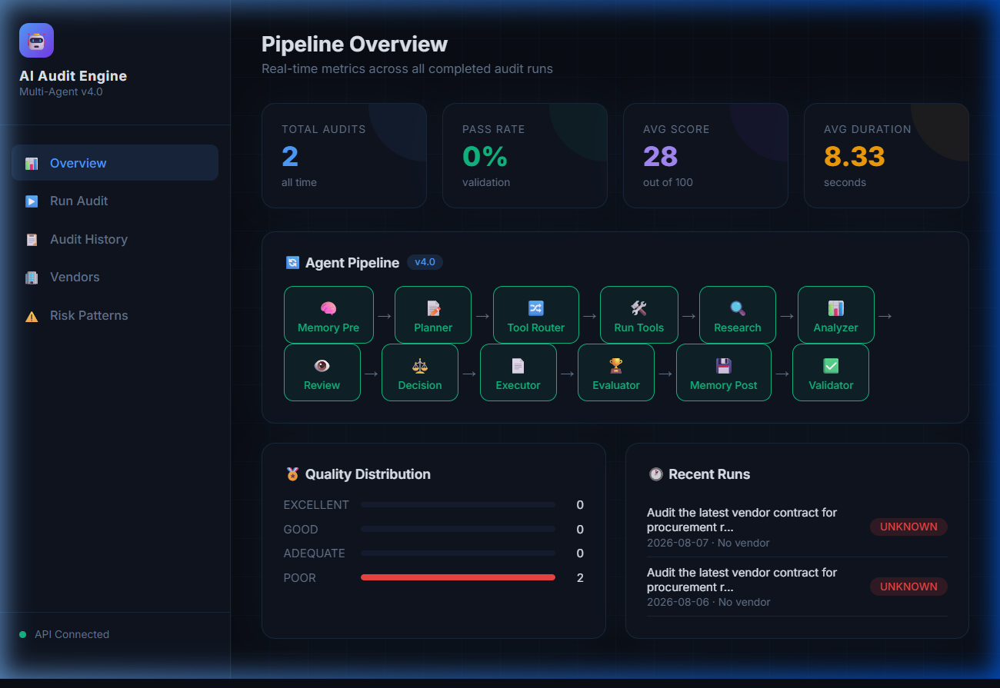
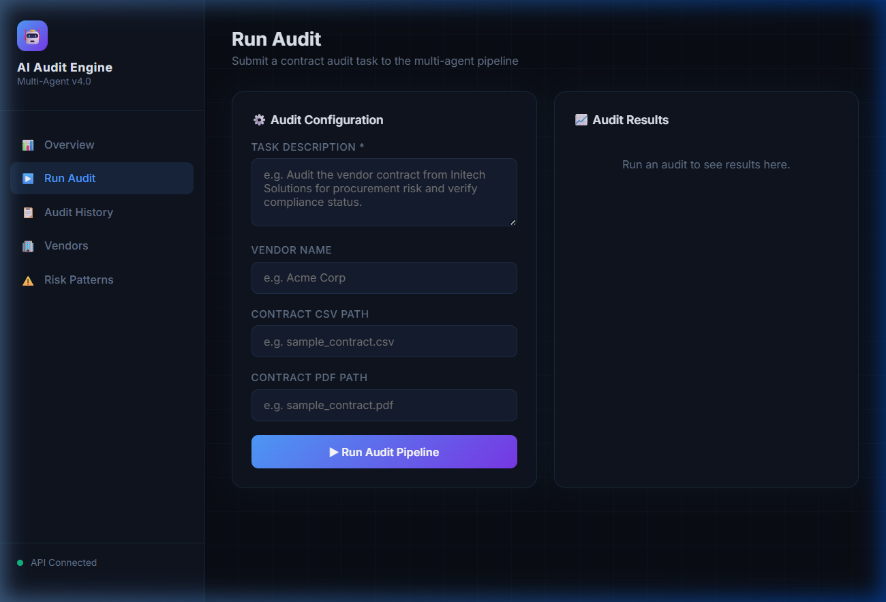
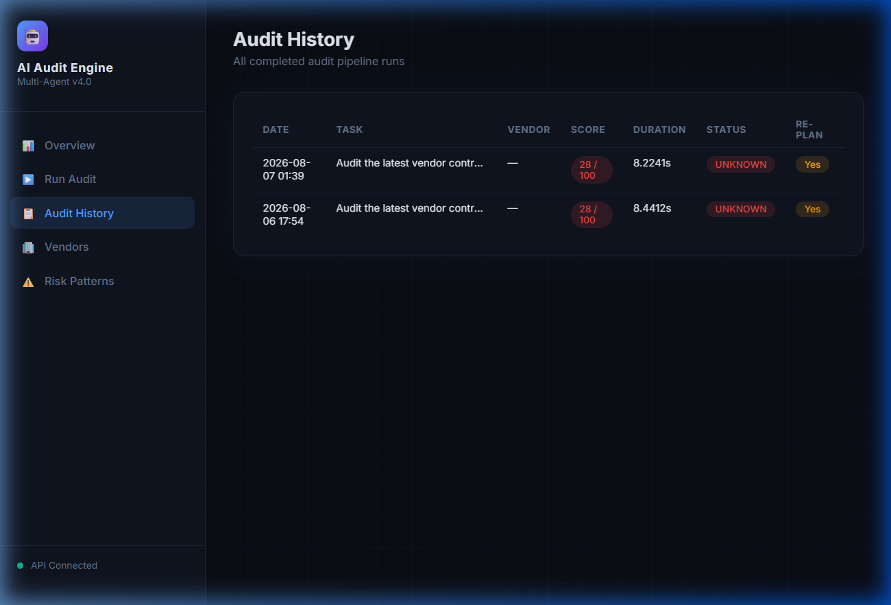
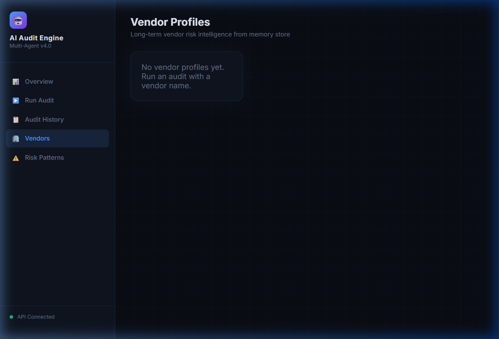
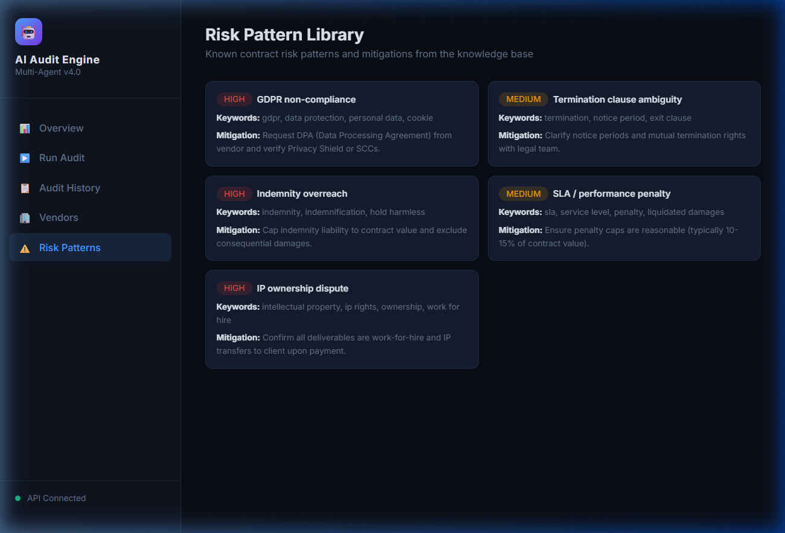

# 🤖 AI Agent Coordination & Decision Engine

A multi-agent AI system for **contract auditing and vendor risk analysis**, built with LangGraph, Groq (LLaMA), and FastAPI. Specialized agents collaborate through a state-driven orchestrator to parse contracts, assess risk, and deliver actionable decisions — all accessible via a REST API and interactive dashboard.

---

## 📸 Dashboard Screenshots

### Overview
Pipeline stats, quality distribution, and recent audit runs at a glance.



### Run Audit
Submit audits with vendor name, PDF contract, and CSV data. Results include a score ring, dimension breakdown, and AI-generated analysis.



### Audit History
Browse all completed audit runs with scores, durations, and status.



### Vendors & Risk Patterns

| Vendors | Risk Patterns |
|---------|---------------|
|  |  |

---

## 🏗️ Architecture

```
User Request
    │
    ▼
┌──────────┐    ┌────────────┐    ┌────────────┐    ┌────────────┐
│ Planner  │───▶│ Retriever  │───▶│  Analyzer  │───▶│  Decision  │
└──────────┘    └────────────┘    └────────────┘    └────────────┘
                                                          │
                                        ┌─────────────────┼─────────────┐
                                        ▼                 ▼             ▼
                                  ┌──────────┐    ┌────────────┐  ┌───────────┐
                                  │  Review  │    │  Executor  │  │ Validator │
                                  │(High Risk)│    └────────────┘  └───────────┘
                                  └──────────┘
```

**Key Components:**

| Component | Description |
|-----------|-------------|
| **Orchestrator** | LangGraph state machine coordinating all agents |
| **Tool Router** | LLM-driven + heuristic fallback for tool selection |
| **Memory Manager** | Short-term (audit) + long-term (vendor profiles) memory |
| **Evaluator** | Scores outputs on accuracy, completeness, relevance |
| **Research Agent** | Web search via DuckDuckGo for real-time context |

**Integrated Tools:**

| Tool | Input | Purpose |
|------|-------|---------|
| `PDFContractParserTool` | `.pdf` file path | Parse and chunk PDF contracts |
| `PandasAuditTool` | `.csv` file path | Detect risk clauses in spreadsheet data |
| `VendorRiskApiTool` | Vendor name | External vendor risk profile lookup |

---

## 📁 Project Structure

```
├── agents/               # All specialized agent modules
│   ├── planner.py        # Task planning
│   ├── retriever.py      # Data retrieval
│   ├── analyzer.py       # Contract analysis
│   ├── decision.py       # Decision making
│   ├── review.py         # High-risk review
│   ├── executor.py       # Report generation
│   ├── validator.py      # Output validation
│   ├── tools.py          # PDF, CSV, VRM tools
│   ├── doc_parser.py     # PDF contract parser
│   ├── vendor_api.py     # Vendor risk API client
│   ├── research_agent.py # Web research agent
│   ├── memory_manager.py # Memory management
│   ├── evaluator.py      # Quality evaluation
│   └── prompt_templates.py
├── workflows/
│   ├── Orchestrator.py   # LangGraph state machine
│   └── metrics.py        # Pipeline metrics tracking
├── api/
│   └── app.py            # FastAPI server + dashboard
├── dashboard/
│   └── index.html        # Single-page dashboard UI
├── memory/               # Persistent audit & vendor memory
├── data/                 # Sample contracts (PDF, CSV)
├── tests/                # Pytest suite (27 tests)
├── main.py               # CLI entry point
└── requirements.txt
```

---

## 🚀 Quick Start

### 1. Clone & Install

```bash
git clone https://github.com/Reshma-kotni/AI-Agent-coordination-and-Decision-engine.git
cd AI-Agent-coordination-and-Decision-engine

python -m venv venv
source venv/bin/activate        # Windows: venv\Scripts\activate

pip install -r requirements.txt
```

### 2. Configure

Create a `.env` file in the project root:

```env
GROQ_API_KEY=your_groq_api_key_here
```

### 3. Run

**CLI mode:**
```bash
python main.py
```

**API + Dashboard:**
```bash
uvicorn api.app:app --host 0.0.0.0 --port 8000 --reload
```
Then open **http://localhost:8000/dashboard/** in your browser.

---

## 🔌 API Endpoints

| Endpoint | Method | Description |
|----------|--------|-------------|
| `/` | GET | Health check |
| `/audit` | POST | Run full audit pipeline |
| `/report` | GET | Download `final_report.txt` |
| `/history` | GET | All past audit records |
| `/metrics` | GET | Aggregate pipeline stats |
| `/vendors` | GET | All vendor profiles |
| `/vendors/{name}` | GET | Specific vendor profile |
| `/risk-patterns` | GET | Risk pattern library |
| `/docs` | GET | Swagger UI |

---

## 🧪 Tests

```bash
pytest tests/ -v
```

**27 tests** across 3 modules:
- `test_memory.py` — Memory manager (14 tests)
- `test_orchestrator.py` — Pipeline integration (1 test)
- `test_tools.py` — PDF, CSV, VRM tools (12 tests)

---

## 🛠️ Tech Stack

- **LLM**: Groq (LLaMA 3) — fast inference
- **Orchestration**: LangGraph — state machine workflows
- **API**: FastAPI + Uvicorn
- **Frontend**: Vanilla HTML/CSS/JS dashboard
- **Tools**: PyPDF, Pandas, DuckDuckGo Search
- **Testing**: Pytest
